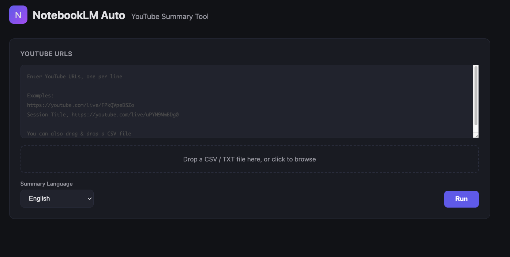
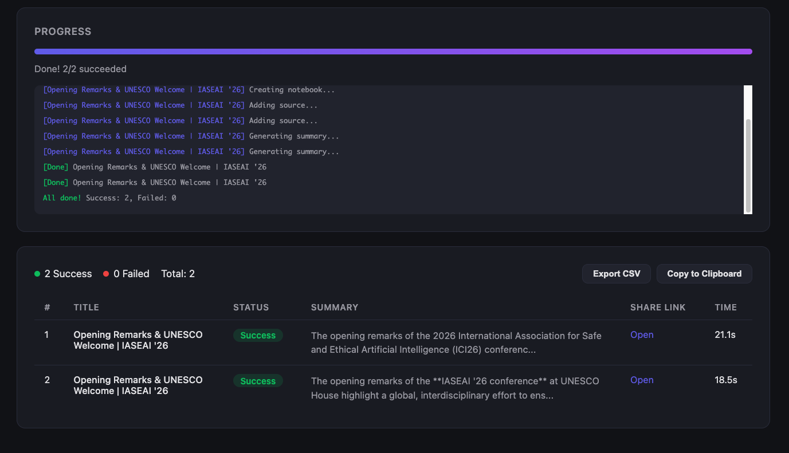

# NotebookLM Auto

Batch-create [Google NotebookLM](https://notebooklm.google.com/) notebooks from YouTube URLs, automatically generate summaries, and get shareable links — all at once.

## Features

- **Batch processing** — Pass a list of YouTube URLs and get NotebookLM notebooks created automatically
- **Auto-titling** — Fetches YouTube video titles and uses them as notebook names
- **AI summaries** — Generates summaries in any language (Japanese, English, or custom prompts)
- **Auto-sharing** — Automatically sets notebook access to "Anyone with a link" and returns shareable URLs
- **Flexible output** — Export results as CSV, JSON, or Markdown
- **Web UI & CLI** — Intuitive browser UI with real-time progress, or use the command line
- **Bulk import** — Load URLs from CSV or TXT files

## Screenshots

### Input — Enter YouTube URLs or upload a CSV file


### Results — Real-time progress and summary table


## Quick Start

### Prerequisites

- Python 3.10+
- A Google account with access to [NotebookLM](https://notebooklm.google.com/)

### Installation

```bash
git clone https://github.com/s00048ri/notebooklm-auto.git
cd notebooklm-auto

# Create a virtual environment
python -m venv .venv
source .venv/bin/activate  # macOS/Linux
# .venv\Scripts\activate   # Windows

# Install dependencies
pip install -e "."

# Install Flask for the Web UI (optional)
pip install flask

# Install Playwright browser
playwright install chromium
```

### Login to NotebookLM

On first use, authenticate with your Google account:

```bash
notebooklm login
```

A browser window will open — sign in with your Google account. Session credentials are stored locally.

### Usage

#### Web UI (Recommended)

```bash
python -m notebooklm_auto.web
```

Open `http://localhost:5000` in your browser. From there you can:

- Enter YouTube URLs (one per line) or drag & drop a CSV file
- Choose summary language (Japanese / English / Custom prompt)
- Watch real-time processing progress
- Export results as CSV or copy to clipboard

#### CLI

```bash
# Process URLs from a file
notebooklm-auto --file urls.csv

# Pass URLs directly
notebooklm-auto --urls https://youtube.com/watch?v=xxx https://youtube.com/watch?v=yyy

# Summarize in English
notebooklm-auto --file urls.csv --prompt "Summarize the key points in English"

# Specify output format
notebooklm-auto --file urls.csv --output-format csv
```

## Input Formats

### Plain text (urls.txt)

```
https://youtube.com/watch?v=xxxxx
https://youtube.com/watch?v=yyyyy
```

### CSV (urls.csv)

```csv
Session Title,YouTube URL
My First Session,https://youtube.com/watch?v=xxxxx
My Second Session,https://youtube.com/watch?v=yyyyy
```

If a `Session Title` / `Title` / `Name` column is present, it will be used as the notebook name. Otherwise, the YouTube video title is fetched automatically.

## Configuration

Customize settings in `config.yaml`:

```yaml
# Summary prompt (can be overridden with --prompt flag)
summary_prompt: "Summarize the key points of this video"

# Max concurrent notebooks (keep low to avoid rate limits)
max_concurrent: 2

# Output format: json / csv / markdown
output_format: csv

# Output directory
output_dir: ./output
```

## How It Works

1. Reads a list of YouTube URLs
2. For each URL:
   - Fetches the video title via the YouTube oEmbed API (no API key needed)
   - Creates a NotebookLM notebook via browser automation (Playwright)
   - Adds the YouTube video as a source
   - Asks the AI to generate a summary based on your prompt
   - Sets access to "Anyone with a link" and retrieves the shareable URL
3. Outputs results as CSV / JSON / Markdown

Powered by [`notebooklm-py`](https://github.com/nichochar/notebooklm-py) and [Playwright](https://playwright.dev/).

## Project Structure

```
notebooklm-auto/
├── src/notebooklm_auto/
│   ├── __init__.py
│   ├── __main__.py        # python -m entry point
│   ├── main.py            # CLI entry point
│   ├── web.py             # Web UI server (Flask + SSE)
│   ├── config.py          # Configuration management
│   ├── input_parser.py    # URL input parser (CSV/TXT)
│   ├── processor.py       # NotebookLM automation core
│   ├── output_writer.py   # Result output (JSON/CSV/Markdown)
│   ├── models.py          # Data models
│   ├── templates/
│   │   └── index.html     # Web UI template
│   └── static/            # Static assets
├── config.yaml            # Default configuration
├── pyproject.toml
└── README.md
```

## Notes

- NotebookLM does not have a public API — this tool uses browser automation via Playwright
- If your session expires, re-run `notebooklm login`
- Increasing `max_concurrent` above 3 may trigger rate limits (default: 2 is recommended)

## License

MIT

---

# 日本語ドキュメント

## 概要

YouTubeのURLリストからGoogle NotebookLMノートブックを自動作成し、要約と共有リンクを一括生成するツールです。

## 主な機能

- YouTube URLのリストを入力するだけで、NotebookLMノートブックを自動作成
- 動画タイトルを自動取得してノートブック名に設定
- 要約を自動生成（日本語・英語・カスタムプロンプト対応）
- ノートブックのアクセス権を「リンクを知っている全員」に自動設定し、共有リンクを取得
- CSV/JSON/Markdown形式で結果を出力
- Web UI（リアルタイム進捗表示付き）とCLIの両方に対応

## セットアップ

### 1. インストール

```bash
git clone https://github.com/s00048ri/notebooklm-auto.git
cd notebooklm-auto

# 仮想環境を作成
python -m venv .venv
source .venv/bin/activate  # macOS/Linux
# .venv\Scripts\activate   # Windows

# 依存関係をインストール
pip install -e "."

# Web UIを使う場合はFlaskもインストール
pip install flask

# Playwrightのブラウザをインストール
playwright install chromium
```

### 2. NotebookLMへのログイン

初回のみ、以下のコマンドでGoogleアカウントにログインします：

```bash
notebooklm login
```

ブラウザが開くので、Googleアカウントでログインしてください。セッション情報がローカルに保存されます。

### 3. 使い方

#### Web UI（おすすめ）

```bash
python -m notebooklm_auto.web
```

ブラウザで `http://localhost:5000` にアクセスすると、以下の操作ができます：

- YouTube URLの入力（1行1URL、またはCSVファイルのアップロード）
- 要約言語の選択（日本語/英語/カスタム）
- リアルタイムの処理進捗表示
- 結果のCSVエクスポート・クリップボードコピー

#### CLI

```bash
# URLリストファイルから実行
notebooklm-auto --file urls.csv

# URLを直接指定
notebooklm-auto --urls https://youtube.com/watch?v=xxx https://youtube.com/watch?v=yyy

# 英語で要約
notebooklm-auto --file urls.csv --prompt "Summarize the key points in English"

# 出力形式を指定
notebooklm-auto --file urls.csv --output-format csv
```

### 4. 入力ファイルの形式

#### テキストファイル（urls.txt）

```
https://youtube.com/watch?v=xxxxx
https://youtube.com/watch?v=yyyyy
```

#### CSVファイル（urls.csv）

```csv
Session Title,YouTube URL
セッション名1,https://youtube.com/watch?v=xxxxx
セッション名2,https://youtube.com/watch?v=yyyyy
```

CSVに `Session Title` / `Title` / `Name` 列があればノートブック名に使用します。列がない場合はYouTube動画のタイトルを自動取得します。

## 注意事項

- NotebookLMには公式APIが存在しないため、Playwrightによるブラウザ自動操作で動作します
- セッションが切れた場合は `notebooklm login` で再ログインしてください
- 同時処理数を上げすぎるとレート制限に引っかかる可能性があります（推奨: 2〜3）
